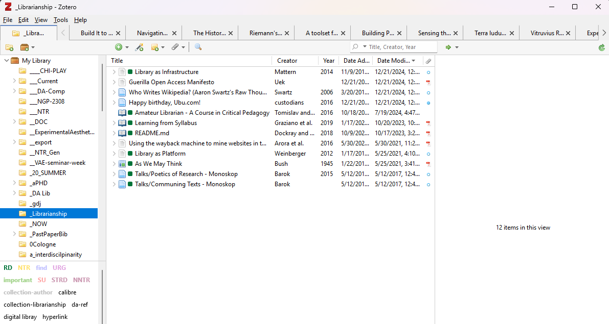
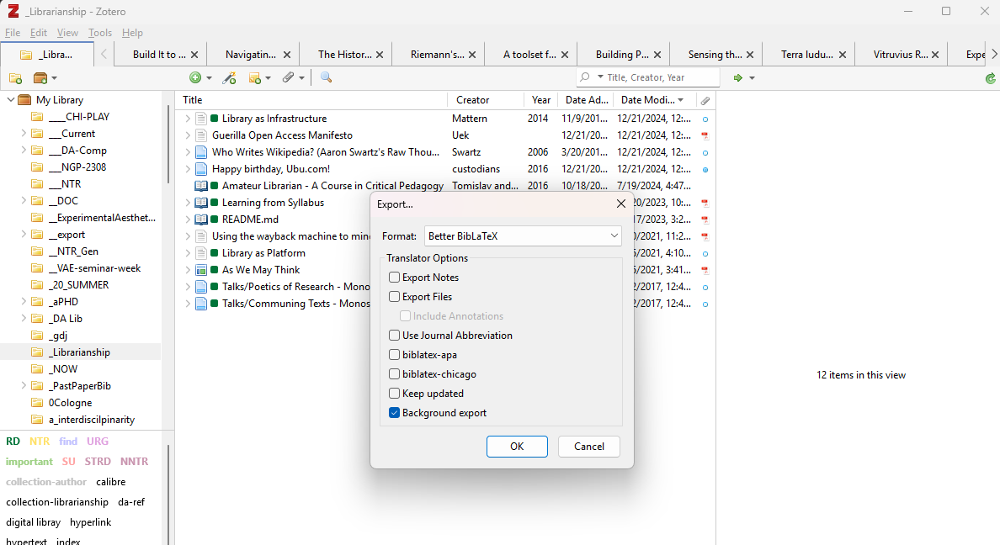

# Overview

This is a workflow guide for writing academic documents in [Markdown](Apparatus/Markdown.md), and compiling to a range of document formats, using free and open source software. See also the related [Obsidian](Apparatus/Obsidian.md) template [Template, Article](XTRAS/TEMPLATES/Template,%20Article.md).

Overall, creating 'academic' documents requires:  
1. citing bibliographic sources, and  
2. rendering bibliographic references according to a particular citation style. 

This guide covers using:   
- [Markdown](Apparatus/Markdown.md) (for writing and citing sources)  
- [Zotero](Apparatus/Zotero.md) (for creating bibliographies), and   
- [Pandoc](Apparatus/Pandoc.md) (for exporting to various document formats--e.g. PDF and DOCX-- with rendered citations and bibliographic references according to specific citation styles). 

# Step 1: Prepare Bibliography and export bib file 
Note: The following describes exporting bibliography collections (as bib files from Zotero). See also the [Zotero](Apparatus/Zotero.md) Obsidian Integration plugin (Setting/Community Plugins/Zotero Integration)
1. Install the [Zotero](Apparatus/Zotero.md) plugin [Better BibTex for Zotero](https://retorque.re/zotero-better-bibtex/). 
   This plugin generates customizable citation keys for all Zotero items, and exporting collections to BibTex and BiBLaTex formats.  
2. Export your bibliographic collection.   
	1. Add the sources you want to use in a collection (Zotero folder)
	   
	3. Right click on collection and do Export Collection as BetterBibLaTeX (which requires the Better BiBTex for Zotero Plugin).   
	   - Save that file (e.g. `bibliography.bib`), at a location that makes sense (ether next to your Markdown document, or at a specific directory reserved for bib files).   
	   - Checking the option *Keep Updated* will auto-export the bibliography file every time there is a change (metadata edit, or addition/removal of sources).   
	    

# Step 2: Get a Citation Style (CSL) file 
1. Browse CSL styles (Citation Style Language) at:
   - the [Zotero database](https://www.zotero.org/styles), 
   - the [CSL Github Repository](https://github.com/citation-style-language/styles), or 
   - the Zotero styles directory on your computer (`your-username/Zotero/styles/)
2. Save your CSL file locally (either next to your MD document, or at a dedicated directory, for this example I use the directory `XTRAS/CSL/`).  

# Step 3: Markdown document setup

## Reference BIB and CSL files 

Use the `bibliography` and `csl` properties to reference your  bibliography and CSL files in the frontmatter of your Markdown document. 
In this particular implementation my BIB and CSL files are in `/xtras/bib/` and `/xtras/csl/`'. 
Relative to my markdown document, these are one directory before, thus the `../` prefix. 

```
--- 
bibliography: ../xtras/bib/bibliography.bib
csl: ../xtras/csl/chicago-author-date.csl
--- 
```

## Link citations to bibliographic references 

To automatically create hyperlinks from citations to bibliographic references add the following property to your frontmatter: 

```
link-citations: true
```

## Setup document metadata 

See also [Pandoc Variables](https://pandoc.org/chunkedhtml-demo/6.2-variables.html). 

Setup basic document metadata: 

```
--- 
title: Some title
author: Jane Doe
abstract: My abstract....
--- 
```

Optionally, add author affiliation
```
author: Jane Doe^[University of Something]
```

For multiple authors do: 

```
author:
- Alice Alisson^[First, Oldest Institute]
- Bob Bobson^[First, Oldest Company]
- Charlie Charlson^[Second, Newer Company]
```

# Step 4: Write and cite in Markdown 

## Citing sources 
To cite sources in your Markdown document use the corresponding citation keys in the form of `[@citationkey]` for (Author 2005), or `@citationkey` for Author (2005) --for author-note citation styles. 
Use `[-@citationkey]` to suppress author. 
Separate multiple citation keys with semicolon as in `[@keyone;@keytwo]`

Citation keys are visible in Zotero (with BetterBibTeX installed), and in your your `bibliography.bib`. 

Examples: 
```
[@tomislav2016]

See Graziano and colleagues [-@graziano2019]

[@dockray2018;@weinberger2012]
```
Rendered as:   

[@tomislav2016]

See Graziano and colleagues [-@graziano2019]

[@dockray2018;@weinberger2012]

## Including uncited items 
To include uncited items to the document's bibliography, add the corresponding keys to the document's properties as in: 
```
nocite: |
  @item1, @item2
```
or 
```
[nocite@somekey]
```
To create a bibliography of all sources from your bib file without citing them do: 
```
nocite: |
  @*
```

## Place bibliographic references 

By default [Pandoc](Apparatus/Pandoc.md) will place the bibliography of cited items at the end of the document--without a heading. Therefore, add the desired bibliography heading at the end of your document (e.g. `# References` or `# Bibliograpy`): 

```
Last sentence of my document. 

# References (bibliography will be rendered below)
```

To add the bibliography at a different place, add the following in the place where you want your bibliography to appear:  
```
::: {#refs}
:::
```
# Step 4: Export document using [Pandoc](Apparatus/Pandoc.md)

- Option 1: If using [Obsidian](Apparatus/Obsidian.md), it's rather easy to [Export using the Obsidian Pandoc plugin](#exp-obsidian)
- Option 2: [Export with Pandoc via terminal](#exp-terminal) 

## Export with Pandoc via terminal {#exp-terminal}

It's recommended to reference the BIB and CLS files in the MD document properties, as in:   
```
---
bibliography: "../xtras/bib/mybib.bib"
csl: "../xtras/csl/chicago-author-date.csl"
---
```

If so, with [Pandoc](Apparatus/Pandoc.md)  installed, open a terminal and type:  
```
pandoc -i path/to/mymarkdown/file.md -o path/to/myexport/file.docx --citeproc
```

If the BIB and CSL files are not referenced then, do: 

```
pandoc -i path/to/mymarkdown/file.md -o path/to/myexport/file.docx --bibliography="path/to/bibliography.bib" csl="path/to/citation-style.csl" --citeproc
```

## Basic pandoc flags 

| Flag         | Descriptions     |
| ------------ | ---------------- |
| `-i`         | input file       |
| `-o`         | output file      |
| `--citeproc` | render citations |

See also [Pandoc metadata fields](https://pandoc.org/MANUAL.html#other-relevant-metadata-fields). 

## Export using the Obsidian Pandoc plugin {#exp-obsidian}

**Install**  
Install the [Pandoc](Apparatus/Pandoc.md) community plugin from Settings/Community Plugins/Browse. 
After installing, enable the plugin. 

**Setup**  
Setup (see [Obsidian Pandoc citations](https://github.com/OliverBalfour/obsidian-pandoc/wiki/Citations-(work-in-progress))) Pandoc plugin, in Settings/Pandoc plugin: 
 - Set "Export files from HTML or markdown?" to "Markdown"
- Append `--citeproc` to "Extra Pandoc arguments"

**Export**   
With your Markdown document open; Open the command palette (Ctrl/Cmd+P) and search for commands starting with *Pandoc Plugin*.  For example, the command `Pandoc Plugin: Export as PDF (via Latex)` will generate a PDF with the same name as the note and, according to default settings, save it in the same folder as the note.

# My custom bibliography heading  

