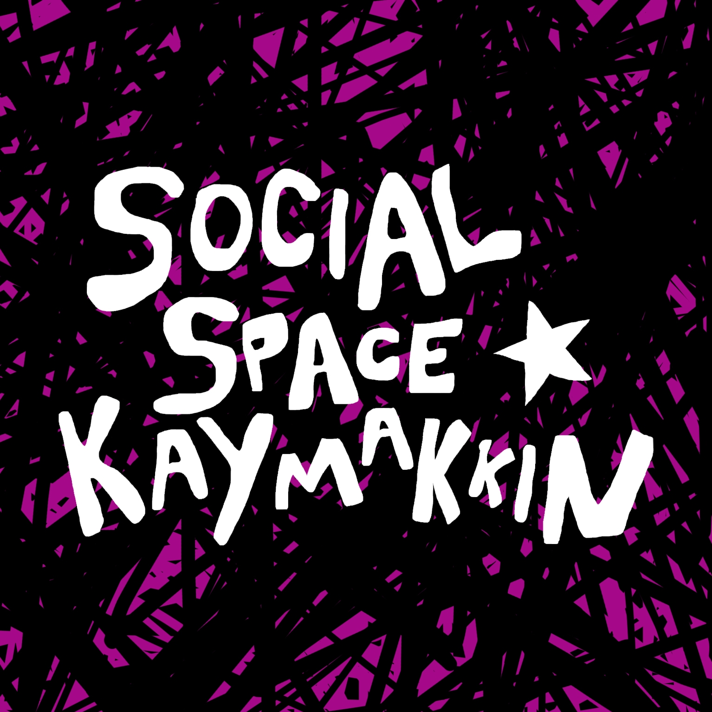

# Description 
This repository is a resource on free and open source software (FOSS) and workflows, put together for a set of workshops organized at Social Space Kaymakkin, in Nicosia, in December 2024 (Sunday 15.12.2024; and Saturday 21.12.2024).  

The repository was put together as an [Obsidian](Apparatus/Obsidian.md) vault, and contains multiple [Markdown](Apparatus/Markdown.md) with extensive information on components of the workshop. 

Browse on [GitHub](https://github.com/cmiltiadis/kaymakkin), or download the repository and open it as an [Obsidian](Apparatus/Obsidian.md) vault. 




# Outline 
- [Workshop software & links](#Workshop%20software%20&%20links)
- [Workshop structure](#Workshop%20structure)
- [Vault folder structure](#Vault%20folder%20structure)
- [Vault contents](#Vault%20contents)
- See also the [Guide for academic writing in Markdown](Articles/Markdown-Article-Guide.md)
# Workshop software & links 

| name      | Vault entry                         | URL                            | Description                                                                             |
| --------- | ----------------------------------- | ------------------------------ | --------------------------------------------------------------------------------------- |
| Markdown  | [Markdown](Apparatus/Markdown.md)   | https://www.markdownguide.org/ | lightweight markup language                                                             |
| Calibre   | [Calibre](Apparatus/Calibre.md)     | https://calibre-ebook.com/<br> | e-book management                                                                       |
| Zotero    | [Zotero](Apparatus/Zotero.md)       | https://www.zotero.org/        | bibliography management                                                                 |
| Pandoc    | [Pandoc](Apparatus/Pandoc.md)       | https://pandoc.org/            | document converter                                                                      |
| PanWriter | [PanWriter](Apparatus/PanWriter.md) | https://panwriter.com/         | [Markdown](Apparatus/Markdown.md) editor with [Pandoc](Apparatus/Pandoc.md) integration |
| Obsidian  | [Obsidian](Apparatus/Obsidian.md)   | https://obsidian.md/           | (Free) [Markdown](Apparatus/Markdown.md) editor for knowledge organization              |
| Hugo      | [Hugo](Apparatus/Hugo.md)           | https://gohugo.io/             | Static website builder                                                                  |

# Vault folder structure 

Content 
- Apparatus 
- Additional notes 
- Open Hardware 
- My Articles 

Additional directories  
- XTRAS
	- BIB (for bib files)
	- CSL (for citation style files)
	- TEMPLATES (for Obsidian Note templates)
- XPORTS (for documents exported via Pandoc)
- XIMG (for images)
- WIP 
  For work-in-progress notes
- TAGS 
  For Notes that serve as MOCs

# Workshop structure 

Writing 
+ [Obsidian](Apparatus/Obsidian.md) -- free software for note-taking, knowledge organization & [Zettelkasten](Additional/Zettelkasten.md) , using an extended version of Markdown)
+ See also [Logseq](Apparatus/Logseq.md), a FOSS for [Bullet journaling](Additional/Bullet%20journaling.md) & [Zettelkasten](Additional/Zettelkasten.md) using Markdown) 

Document publishing
+ [Pandoc](Apparatus/Pandoc.md)-- FOSS, universal document converter (that fully supports MD)
	+ [PanWriter](Apparatus/PanWriter.md) -- FOSS [Markdown](Apparatus/Markdown.md) editor that provides a GUI for Pandoc  

Web publishing 
+ [Hugo](Apparatus/Hugo.md) -- FOSS, static website builder (that uses [Markdown](Apparatus/Markdown.md) files)

Library organization   
+ [Calibre](Apparatus/Calibre.md) -- General purpose e-book management 
	+ [Accorder](Apparatus/Accorder.md)--Command line tool for creating portable libraries via [Calibre](Apparatus/Calibre.md) 
+ [Zotero](Apparatus/Zotero.md)-- Bibliographic reference management. 

# Vault contents 

See either: 
- [Contents (Hardcoded)](#contents-hard), or 
- [Vault contents via Obsidian Dataview](#Vault%20contents%20via%20Obsidian%20Dataview) (which requires opening this vault in Obsidian with the Dataview plugin installed[^dataview]). 

[^dataview]:  To install the [Obsidian](Obsidian.md) *Dataview* plugin go to Settings/Community Plugins/Browse, and search for Dataview. For documentation and demonstration see: 
	- [Dataview](https://blacksmithgu.github.io/obsidian-dataview/)
	- [Nicole van der Hoeven - How to use the Obsidian Dataview plugin (YouTube)](https://www.youtube.com/watch?v=JTObSymEvWA)

## Contents (Hardcoded) {#contents-hard}
- [Recipe](TAGS/Recipe.md)
- Software & tool apparatus:  
	- [Markdown](Apparatus/Markdown.md)
	- [Obsidian](Apparatus/Obsidian.md)
	- [Calibre](Apparatus/Calibre.md)
		- See also [Accorder](Apparatus/Accorder.md)
	- [Zotero](Apparatus/Zotero.md)
	- [Pandoc](Apparatus/Pandoc.md)
		- [PanWriter](Apparatus/PanWriter.md) --FOSS Markdown editor and GUI interface for Pandoc. 
	- [Git](Apparatus/Git.md) --versioning system
	- [Hugo](Apparatus/Hugo.md) --static website builder that uses [Markdown](Apparatus/Markdown.md) files 
- Additional tools & Notes 
	- [Markdown-Article-Guide](Articles/Markdown-Article-Guide.md)
	- [Productivity applications](Additional/Productivity%20applications.md)
	- [Libraries](Additional/Libraries.md)--a list of online libraries
	- [Zettelkasten](Additional/Zettelkasten.md)
	- [Bullet journaling](Additional/Bullet%20journaling.md)
	- [Mensajito](Open%20Hardware/Mensajito.md)--open hardware for radio streaming

## Vault contents via Obsidian Dataview 
### DV: Map of Content (MOC) notes  

```dataview
TABLE title as Title, summary
FROM #MOC 
```

## DV: Software apparatus  (/Apparatus)

```dataview 
TABLE tags
FROM "Apparatus"
```

### DV: Additional  (/Additional notes & /Open hardware) 

```dataview 
TABLE without id
	file.link as Title, tags
FROM "Additional notes" or "Open Hardware"
```
### DV: Templates (/XTRAS/TEMPLATES)
```dataview 
Table summary as Summary
FROM "XTRAS/TEMPLATES"
```

### DV: /Recipes ([Recipe](TAGS/Recipe.md))

```dataview 
TABLE title,summary, tags,date FROM "Recipes"
```

--- 

